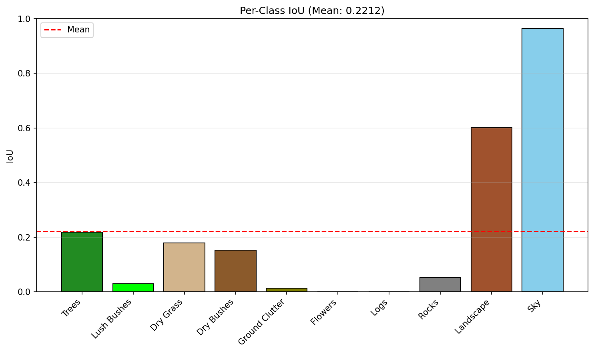

# 🚀 Semantic Scene Segmentation

A semantic segmentation model for off-road/rover imagery using **DINOv2 Vision Transformer** backbone with a custom ConvNeXt-style decoder head.


## 📊 Performance

| Metric | Validation | Test |
|--------|------------|------|
| **Mean IoU** | 51.22% | 22.12% |
| mAP50 | - | 18.99% |

## 🏗️ Architecture

```
Image → DINOv2 ViT-Base (frozen) → Patch Tokens → Segmentation Head → Prediction
```

- **Backbone**: DINOv2 `vitb14_reg` (768-dim embeddings, frozen)
- **Decoder**: Multi-scale ConvNeXt head (3×3, 5×5, 7×7 depthwise convs + residual)
- **Loss**: Combined CrossEntropy (40%) + Dice Loss (60%) with class weighting

## 🎯 Classes (10 total)

| ID | Raw Value | Class |
|----|-----------|-------|
| 0 | 100 | Trees |
| 1 | 200 | Lush Bushes |
| 2 | 300 | Dry Grass |
| 3 | 500 | Dry Bushes |
| 4 | 550 | Ground Clutter |
| 5 | 600 | Flowers |
| 6 | 700 | Logs |
| 7 | 800 | Rocks |
| 8 | 7100 | Landscape |
| 9 | 10000 | Sky |

## 📁 Project Structure

```
Semantic-Scene-Segmentation/
├── model_scripts/
│   ├── train_segmentation.py    # Training script
│   ├── test_segmentation.py     # Evaluation script
│   └── visualize.py             # Visualization utilities
├── predictions/
│   ├── comparisons/             # Side-by-side visualizations
│   ├── evaluation_metrics.txt   # Test metrics
│   └── per_class_metrics.png    # Per-class performance chart
├── best_model.pth               # Best trained model weights
├── training_results.csv         # Training history
├── requirements.txt             # Dependencies
├── LICENSE                      # MIT License
└── README.md
```

## 🚀 Quick Start

### 1. Setup Environment

```bash
# Clone repository
git clone https://github.com/YOUR_USERNAME/Semantic-Scene-Segmentation.git
cd Semantic-Scene-Segmentation

# Create virtual environment
python -m venv .venv
.venv\Scripts\Activate.ps1  # Windows
# source .venv/bin/activate  # Linux/Mac

# Install dependencies (with CUDA support)
pip install torch torchvision --index-url https://download.pytorch.org/whl/cu124
pip install -r requirements.txt
```

### 2. Prepare Dataset

```
Dataset/
├── train/
│   ├── Color_Images/    # RGB images (.png)
│   └── Segmentation/    # Mask images (.png)
├── val/
│   ├── Color_Images/
│   └── Segmentation/
└── test/
    ├── Color_Images/
    └── Segmentation/
```

### 3. Train Model

```bash
# Train from scratch
python model_scripts/train_segmentation.py --fresh_start

# Continue training from checkpoint
python model_scripts/train_segmentation.py
```

**Training Options:**
| Argument | Description | Default |
|----------|-------------|---------|
| `--model_path` | Best model save path | `best_model.pth` |
| `--last_model_path` | Last epoch model path | `last_model.pth` |
| `--results_csv` | Training metrics CSV | `training_results.csv` |
| `--fresh_start` | Ignore checkpoint, train fresh | `False` |

### 4. Test Model

```bash
python model_scripts/test_segmentation.py
```

**Testing Options:**
| Argument | Description | Default |
|----------|-------------|---------|
| `--model_path` | Model weights path | `best_model.pth` |
| `--data_dir` | Test dataset path | `Offroad_Segmentation_testImages` |
| `--output_dir` | Predictions output | `predictions` |
| `--batch_size` | Inference batch size | `2` |

## 📈 Training Features

- ✅ **DINOv2 Backbone** - Pre-trained ViT-Base with frozen weights
- ✅ **Class-weighted Loss** - Handles imbalanced classes  
- ✅ **Dice + CrossEntropy** - Combined loss for better segmentation
- ✅ **Cosine Annealing** - LR scheduler with warm restarts
- ✅ **Data Augmentation** - Flip, rotation, scale, color jitter
- ✅ **Early Stopping** - Patience of 15 epochs
- ✅ **Gradient Clipping** - Max norm of 1.0

## 🔧 Configuration

Edit `model_scripts/train_segmentation.py`:

```python
BATCH_SIZE = 4
LR = 1e-3
N_EPOCHS = 50
BACKBONE_SIZE = "base"  # small, base, large, giant
```

## 📝 Inference Example

```python
import torch
import torch.nn.functional as F

# Load backbone
backbone = torch.hub.load("facebookresearch/dinov2", "dinov2_vitb14_reg")
backbone.eval().to("cuda")

# Load classifier
from model_scripts.train_segmentation import SegmentationHeadConvNeXt

classifier = SegmentationHeadConvNeXt(
    in_channels=768,
    out_channels=10,
    tokenW=50,  # width // 14
    tokenH=28   # height // 14
)
classifier.load_state_dict(torch.load("best_model.pth"))
classifier.eval().to("cuda")

# Run inference
with torch.no_grad():
    features = backbone.forward_features(image)["x_norm_patchtokens"]
    logits = classifier(features)
    logits = F.interpolate(logits, size=image.shape[2:], mode="bilinear")
    prediction = torch.argmax(logits, dim=1)
```

## 📊 Results

### Training Curve


### Sample Predictions
See `predictions/comparisons/` for side-by-side visualizations.

## 🤝 Contributing

1. Fork the repository
2. Create your feature branch (`git checkout -b feature/amazing-feature`)
3. Commit your changes (`git commit -m 'Add amazing feature'`)
4. Push to the branch (`git push origin feature/amazing-feature`)
5. Open a Pull Request

## 📄 License

This project is licensed under the MIT License - see the [LICENSE](LICENSE) file for details.

## 🙏 Acknowledgments

- [DINOv2](https://github.com/facebookresearch/dinov2) by Meta AI
- Hackster.io Hackathon

## 📧 Contact

Aakash Kumar - aakash.kumar.ug24@nsut.ac.in

---
⭐ Star this repo if you find it useful!
